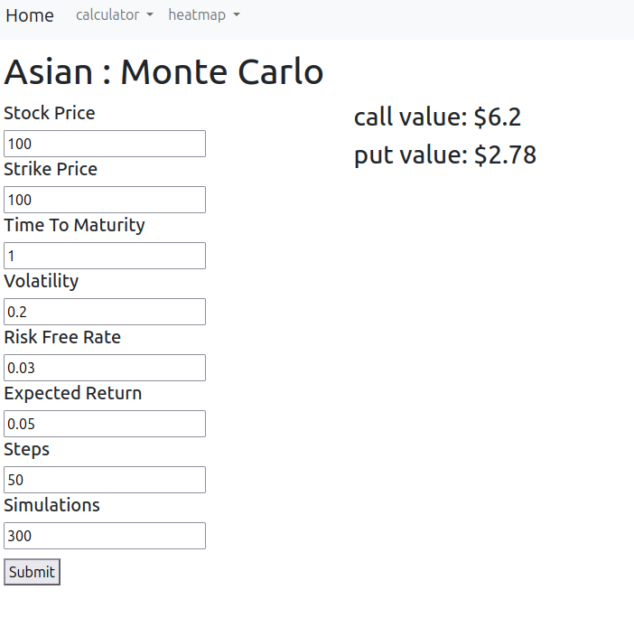
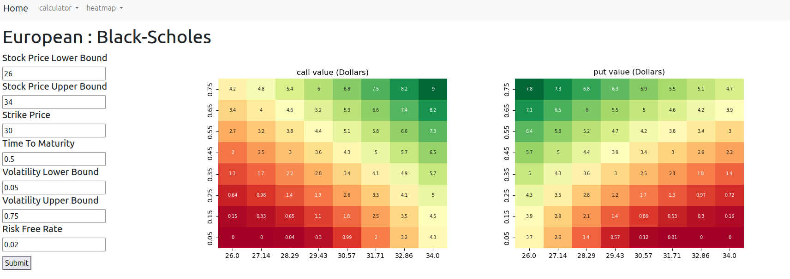
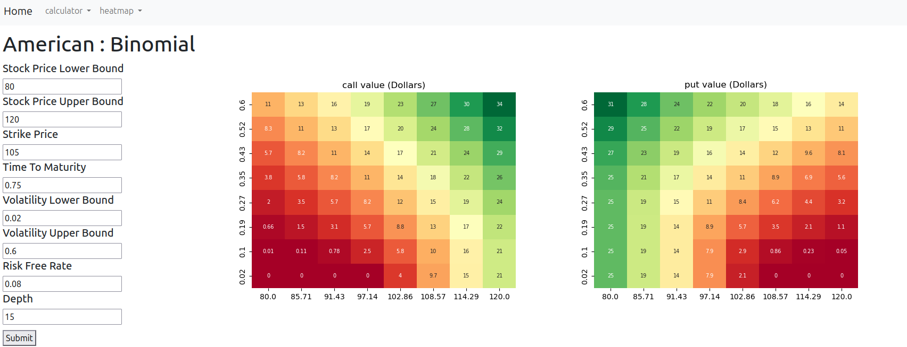

# Options Pricer

This project prices European, American, and Asian options using Black-Scholes, Binomial, and Monte Carlo methods respectively.
It does not calculate implied volatility which is the main use case in industry, nor does it use the greeks. 

## Financial Concepts

### What is an Option
An option gives one the right to buy (in the case of a call option) or sell (in the case of a put option) an asset at, or sometimes before, a given date.

#### European
A European option is one where the purchaser can only exercise (use) the option on the expiry date.

#### American
Unlike a European option an American option allows the purchaser to exercise the option at or before expiry date.

#### Asian
Much like a European option an Asian option is one where the purchaser can only exercise the option on the expiry date.
However, unlike a European option, the value of an Asian option is calculated by averaging the value of the asset over the options lifespan. 

### Methods

#### Black-Scholes
The Black-Scholes equation used in this program is a closed form version, rather than the PDE using the greeks, derived by Fischer Black, Myron Scholes, and Robert Merton.
In this case it is as simple as plugging in the numbers and getting an output, note that the output is only functional for a European option as it does not simulate path.

#### Binomial
In the Binomial model we create a tree of nodes to find where the stock may be going and use it to price the option.
We begin with a starting node with the current price. From this node the price can either go up or down and so we create sub-nodes (or child nodes for the programmer) to simulate each of these possibilities. After that we continue on with this process with each of these sub-nodes and their sub-nodes and so on to create a large tree of possibilities that we use for the pricing. 
We use this method for an American option as the result of an American option pricing depends on the path the stock has taken.

#### Monte Carlo
In a Monte Carlo simulation we simulate many paths the stock can take to price it.
Unlike a Binomial model we don't simulate each possibility only one random possible path per simulation which we average at the end to get a prediction of the result.
This method is used to price Asian options as the result of an Asian option is path dependent and I found it easier than the Binomial alternative. 

## Architecture
This project uses one central config file, located in global_info, to modularly build the html and calculate the option.
In doing it this way we avoid magic string and create a very scalable system.
For instance, if I wanted to add a new pricing method it would be as simple as adding the equation code to the equations directory in logic and then adding the relevant information to the config file.
Alternatively, if I wanted to add a new visualization method I could do it by updating the input and output formatters and adding the new option to the config file.

## Issues
This project took me quite a while and I improved quite a bit over its development meaning some issues arose that I was only able to spot recently as I worked to finish it out.

### Inefficient Binomial code
In a Binomial simulation the path of the stock price increasing and then decreasing should have the same result as the price decreasing and then increasing. As such the node should be the same.
However, in my implementation these are two separate nodes leading to code that can be very slow when creating a large tree and is much slower than a Binomial model otherwise should be. 
This can be fixed by generating all the nodes for the next section of the tree before assigning them.

### Lack of unit tests
This project lacks unit tests for everything except the formatters when in reality the math should also be unit tested.
I skipped this because at the time of writing I hand checked the outputs. However, this means that should the files be changed there is no code to confirm if it is still correct so unit tests should be added in the future.

### Broken macro
The macro in calculate.html does not run as expected. After lots of trial and error, where it wouldn't load at all, I got it to work and I do not fully understand how but I decided to keep it for the time being and in the future I can come back and implement it in an entirely new way.

### Comments
This project largely lacks comments and has no doc string comments reducing readability.

### Functions
This project definitely has inconsistent function sizing where at some points its one function one action and others its one function one idea which leads to less readable code. 

## How to Run
to run this project download the zip from Github, after unpacking it enter it and type "pip install -r requirements.txt" before running "flask run"

## Screenshots

